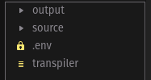
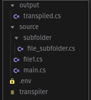

# sBotics file modulator:

A file modulator for big files, separating them, enabling the organization of the code without a headache with copies and pastes!

---

## Features:
- join multiple files / importing files.
- ignore commented imports.
---

## Setup:
1. Download the [lasted compiled version](https://github.com/ViniciosLugli/sBotics-file-modulator/releases) and [.env.example](./.env.example).
2. Move it to your project's root folder;
4. Exec `cp .env.example .env` or manually rename [.env.example](./.env.example) file to `.env`;
5. Replace the corresponding variables in your `.env` file;

### variables
- `WATCH_FOLDER` = Folder where you keep your scripts.
- `INPUT_FILE` = Name with the extension of the input file, which will be located in the scripts folder of the variable `WATCH_FOLDER`.
- `OUTPUT_FILE` = Output path with name of the file where the project transpilation will be exported.
---
## Example:
**Root:**



**Subfolders:**



**Contents:**

_.env_
```bash
#Default configs
WATCH_FOLDER = "./source/" # Example main folder to sources
INPUT_FILE = "main.cs" # Main file name with extension, it should be in your watch folder.
OUTPUT_FILE = "./output/transpiled.cs" # Your output file path with extension

# Change if you have an idea of ​​what you are doing
IMPORTER_REGEX = "importar\((.*?)\)|import\((.*?)\)" # Regex of importer
TABS_REGEX = "^(?:( )+|\t+)" # Regex of tabs
COMMENT_REGEX = "(/\*([^*]|[\r\n]|(\*+([^*/]|[\r\n])))*\*+\/)|(\/\/.*)|(#.*)" #regex of comments
```
_source/main.cs_
```cs
import("file.cs");
import("subfolder/file_subfolder.cs");
```

_source/file1.cs_
```cs
//Hi, i'm file1.cs
```

_source/subfolder/file_subfolder.cs_
```cs
//Hi, i'm file_subfolder.cs
```

After run the sBotics File modulator which is in the root folder, the contents of the `output/transpiled.cs` file is updated to:
```cs
//Hi, i'm file1
//Hi, i'm file_subfolder
```
---
### Information:
- After save any file inside the `WATCH_FOLDER` path, the output is automatically updated!
- For import files you can use `import` or `importar` prefix function.
- The example can be found in [this repository](./example)